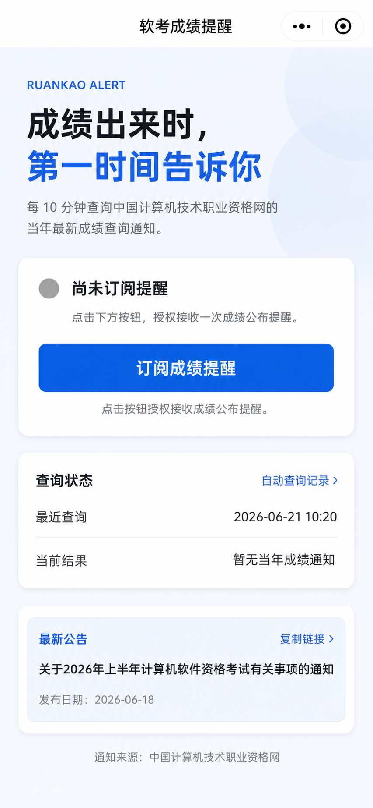
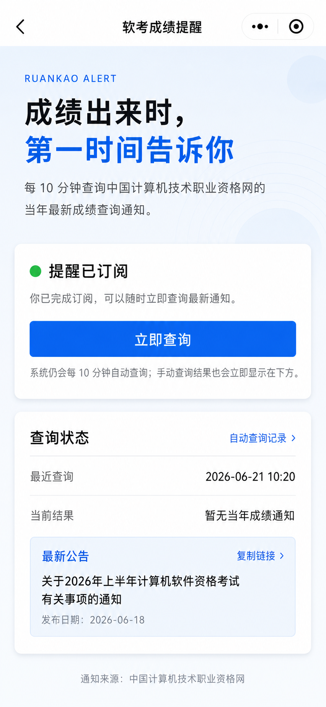
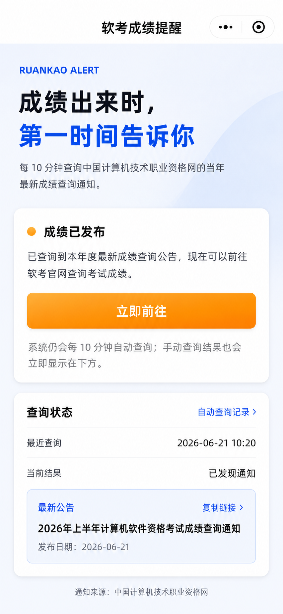
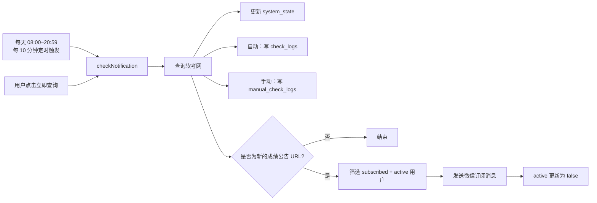

# 软考成绩提醒微信小程序

基于微信小程序原生语法与微信云开发实现的软考成绩提醒工具。系统每天 08:00–20:59 每 10 分钟查询一次中国计算机技术职业资格网；发现当年新的成绩查询公告后，向拥有有效一次性授权的订阅用户发送微信提醒。

## 功能

- 微信一次性订阅消息授权；
- 每天 08:00–20:59 每 10 分钟自动查询软考网；
- 用户可点击“立即查询”手动触发；
- 成绩公告 URL 去重，同一公告不会重复群发；
- 查询到成绩公告后显示“成绩已发布”和“立即前往”；
- 点击“立即前往”复制软考官网成绩查询链接；
- 展示软考网最新一条任意类型公告及发布日期；
- 展示最新 30 条自动查询记录；
- 自动查询和手动查询分别写入日志集合；
- 首次进入和下拉刷新显示骨架屏，手动查询不显示骨架屏；
- 首页支持发送给朋友和分享到朋友圈，并根据成绩发布状态生成分享标题；
- 订阅状态支持 `subscribed` 与 `cancelled`，取消逻辑保留在后端，但当前页面已隐藏取消按钮。

## 页面状态

| 未订阅 | 已订阅 | 成绩已发布 |
| --- | --- | --- |
|  |  |  |

## 项目结构

```text
miniprogram/
  pages/index/                 首页
  pages/records/               自动查询记录页
  assets/                      小程序资源
cloudfunctions/
  subscribe/                   保存和更新订阅状态
  getStatus/                   读取首页状态
  checkNotification/           自动/手动查询、去重、发送、写日志
  getCheckRecords/             读取最新 30 条自动查询记录
docs/assets/                   文档原型图
doc.md                         详细交互与数据说明
```

`testNotification` 是早期测试遗留云函数，当前前端没有入口，不属于正式功能，可不部署或从云端删除。

## 工作流程



## 数据库集合

所有集合建议设置为“仅云函数可读写”。

| 集合 | 用途 | 索引 |
| --- | --- | --- |
| `subscriptions` | 用户订阅业务状态与一次性消息授权状态 | 默认 `_id` |
| `system_state` | 最近查询结果、成绩公告、最新公告及去重 URL | 默认 `_id` |
| `check_logs` | 每次自动查询的成功或失败记录 | `checkedAt` 降序、非唯一 |
| `manual_check_logs` | 每次点击“立即查询”的记录，包括限流失败 | `checkedAt` 降序、非唯一 |

`system_state` 使用固定文档：

```text
集合：system_state
文档 ID：score_notice
```

订阅记录核心字段：

```json
{
  "_id": "用户OPENID",
  "templateId": "订阅消息模板ID",
  "status": "subscribed",
  "active": true,
  "subscribedAt": "服务端时间",
  "cancelledAt": null
}
```

- `status`：用户业务状态，取值为 `subscribed` 或 `cancelled`；
- `active`：微信一次性消息授权是否仍可用于发送；
- 自动发送要求 `status === subscribed && active === true`。

## 部署

1. 在微信开发者工具中导入项目。
2. 将 `project.config.json` 的 `appid` 修改为实际小程序 AppID。
3. 开通云开发；需要固定环境时，在 `miniprogram/config.js` 设置 `cloudEnvId`。
4. 在微信公众平台申请一次性订阅消息模板，建议字段为：
   - `thing1`：通知标题；
   - `date2`：发布日期；
   - `thing3`：温馨提示。
5. 将模板 ID 写入 `miniprogram/config.js`。如果字段名不同，同步修改 `checkNotification/index.js` 的 `messageData`。
6. 创建 `subscriptions`、`system_state`、`check_logs`、`manual_check_logs` 四个集合。
7. 为 `check_logs.checkedAt` 和 `manual_check_logs.checkedAt` 创建降序、非唯一索引。
8. 上传并部署四个正式云函数：
   - `subscribe`；
   - `getStatus`；
   - `checkNotification`；
   - `getCheckRecords`。
9. 确认 `checkNotification` 定时触发器已启用：

```text
0 */10 8-20 * * * *
```

10. 编译并上传小程序前端。

## 页面交互

### 未订阅

- 显示“尚未订阅提醒”；
- 显示“订阅成绩提醒”；
- 用户同意微信授权后写入 `status: subscribed`、`active: true`；
- 如果授权为 `reject` 或 `ban`，引导用户进入微信设置页。

### 已订阅且尚未发现成绩公告

- 显示“提醒已订阅”；
- 显示“立即查询”；
- 手动查询一分钟内只能成功触发一次；
- 每次点击都会写入 `manual_check_logs`，限流也会记录。

### 成绩已发布

- 显示“成绩已发布”；
- 显示“立即前往”；
- 已订阅用户不再显示“立即查询”；
- 点击后复制：`https://bm.ruankao.org.cn/index.php/query/score`；
- 弹窗提示用户前往浏览器粘贴并查询成绩。

### 最新公告

- 与成绩通知判断相互独立；
- 始终取软考网公告列表中发布日期最新的一条；
- 展示标题及 `YYYY-MM-DD` 日期；
- 点击复制公告原文链接，无需配置业务域名。

### 自动查询记录

- 通过独立云函数 `getCheckRecords` 获取；
- 按 `checkedAt` 倒序；
- 页面仅展示最新 30 条；
- 支持下拉刷新，不再分页或加载更多。

## 成绩公告匹配与去重

成绩公告标题需要同时满足：

- 包含当前年份；
- 包含“成绩”；
- 包含“查询”“公布”或“发布”。

例如：

```text
2026年上半年计算机软件资格考试成绩查询通知
```

符合匹配条件。公告 URL 保存于：

```text
system_state / score_notice / latestNotice.url
```

只有 URL 与上次记录不同才会触发群发。

## 一次性订阅消息限制

当前模板为微信一次性订阅消息：

- 每次授权最多发送一条消息；
- 发送成功或失败后，代码都会将 `active` 更新为 `false`；
- `status: subscribed` 可能与 `active: false` 同时存在；
- 页面是否显示“立即查询”由 `status` 决定，不代表还有可用消息授权；
- 测试消息会消耗授权，因此正式版已移除测试按钮。

## 骨架屏

- 首次进入首页：显示；
- 首页下拉刷新：显示；
- 点击“立即查询”：不显示，使用加载提示并直接更新数据。

详细交互和状态图见 [doc.md](doc.md)。

参考：[微信小程序开发文档](https://developers.weixin.qq.com/miniprogram/dev/framework/)
