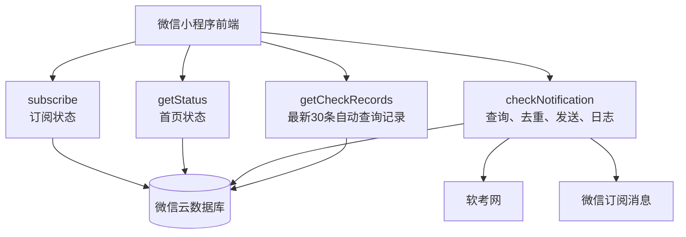
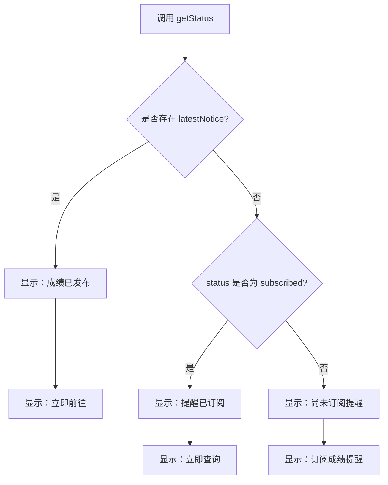
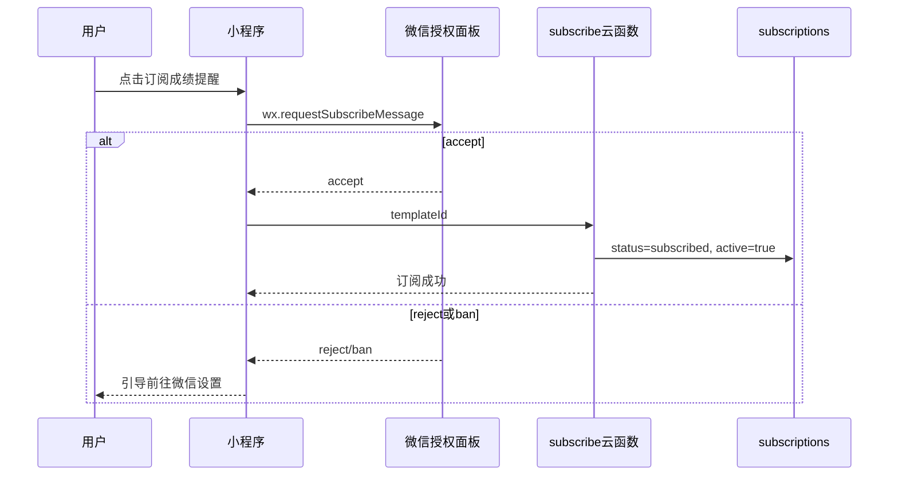
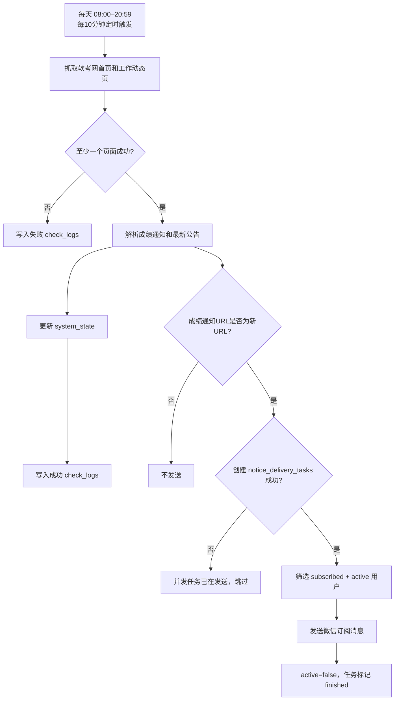
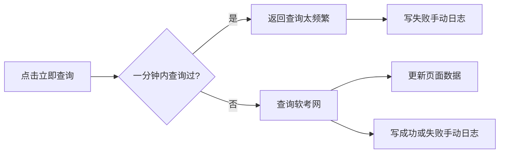

# 软考成绩提醒小程序：功能、交互与数据设计

本文档按当前代码整理，覆盖页面状态、订阅授权、自动/手动查询、成绩提醒、查询日志和数据库设计。

## 1. 系统组成



定时触发器每天 08:00–20:59 每 10 分钟调用一次 `checkNotification`。用户点击“立即查询”也调用同一个云函数，因此两种查询共享成绩公告识别、URL 去重和消息发送逻辑。

## 2. 数据库集合

| 集合 | 主要内容 | 关键索引 |
| --- | --- | --- |
| `subscriptions` | OpenID、模板 ID、业务状态、一次性授权状态 | 默认 `_id` |
| `system_state` | 最近查询、成绩通知、最新公告、发送统计 | 默认 `_id` |
| `notice_delivery_tasks` | 成绩公告发送任务锁，避免并发重复发送 | 默认 `_id` |
| `check_logs` | 自动查询成功/失败记录 | `checkedAt` 降序、非唯一 |
| `manual_check_logs` | 手动查询及一分钟限流记录 | `checkedAt` 降序、非唯一 |

集合权限建议全部设为“仅云函数可读写”。

### 2.1 `subscriptions`

```json
{
  "_id": "用户OPENID",
  "_openid": "用户OPENID",
  "templateId": "模板ID",
  "status": "subscribed",
  "active": true,
  "subscribedAt": "服务端时间",
  "cancelledAt": null,
  "updatedAt": "服务端时间",
  "lastManualCheckAt": "服务端时间",
  "lastError": ""
}
```

| 字段 | 含义 |
| --- | --- |
| `status: subscribed` | 用户业务状态为订阅中 |
| `status: cancelled` | 用户业务状态为已取消 |
| `active: true` | 当前还有可用的一次性消息授权 |
| `active: false` | 授权已发送、发送失败失效，或用户已取消 |

自动通知必须同时满足：

```text
status = subscribed 且 active = true
```

### 2.2 `system_state`

使用固定文档：

```text
集合：system_state
文档 ID：score_notice
```

主要字段包括：

```json
{
  "lastCheckedAt": "服务端时间",
  "latestNotice": {
    "title": "成绩公告标题",
    "url": "成绩公告URL",
    "date": "YYYY-MM-DD"
  },
  "latestAnnouncement": {
    "title": "最新任意类型公告",
    "url": "公告URL",
    "date": "YYYY-MM-DD"
  },
  "lastDelivery": {
    "sent": 0,
    "failed": 0
  },
  "lastError": ""
}
```

### 2.3 `notice_delivery_tasks`

发送成绩提醒前，云函数会按成绩公告 URL 生成 SHA-1 作为文档 ID，并尝试创建一条发送任务：

```json
{
  "_id": "公告URL的SHA-1",
  "noticeUrl": "成绩公告URL",
  "noticeTitle": "成绩公告标题",
  "noticeDate": "YYYY-MM-DD",
  "triggerType": "automatic",
  "status": "sending",
  "delivery": {
    "sent": 0,
    "failed": 0
  },
  "createdAt": "服务端时间",
  "updatedAt": "服务端时间",
  "finishedAt": "服务端时间"
}
```

由于同一个 `_id` 只能创建一次，自动查询和手动查询即使同时发现同一条成绩公告，也只有第一个创建成功的云函数会真正发送消息。其它并发实例会把本次发送结果记为 `skipped: true`，不会重复通知用户。

### 2.4 查询日志

`check_logs` 只保存定时自动查询；`manual_check_logs` 只保存用户点击“立即查询”。两者均记录：

- `checkedAt`；
- `success`；
- `found`；
- `latestNotice`；
- `latestAnnouncement`；
- `delivery`；
- `durationMs`；
- `error`。

手动日志还包含 `userOpenid`。一分钟内重复点击被限流时也会写入失败记录。

## 3. 页面状态与原型图

### 3.1 用户未订阅

页面表现：

- 状态为“尚未订阅提醒”；
- 显示“订阅成绩提醒”；
- 用户点击后调用 `wx.requestSubscribeMessage`；
- 授权成功后写入 `status: subscribed`、`active: true`。


### 3.2 用户已订阅

页面表现：

- 状态为“提醒已订阅”；
- 显示“立即查询”；
- 当前页面不显示取消订阅按钮；
- 点击立即查询后更新查询状态，并写入 `manual_check_logs`。


### 3.3 成绩已发布

页面表现：

- 状态优先显示“成绩已发布”；
- 显示“立即前往”；
- 不管用户是否已订阅，都不再显示“订阅成绩提醒”或“立即查询”；
- 点击后复制官方成绩查询链接并提示前往浏览器打开。

```text
https://bm.ruankao.org.cn/index.php/query/score
```


## 4. 首页状态判定



如果已经发现成绩公告，页面只显示“立即前往”；不管用户是否已订阅，都隐藏“订阅成绩提醒”和“立即查询”。

## 5. 订阅授权流程



订阅中的用户不能重复订阅。后端仍保留取消逻辑：取消时不删除记录，而是更新为 `status: cancelled`、`active: false`。当前前端已隐藏取消入口。

## 6. 自动查询流程



自动查询无论成功或失败都会尝试写入 `check_logs`。自动查询记录页通过独立云函数 `getCheckRecords` 按时间倒序读取最新 30 条，支持下拉刷新，不支持分页加载更多。

## 7. 手动查询流程

订阅用户点击“立即查询”时：

1. 调用 `checkNotification`；
2. 检查一分钟限流；
3. 查询软考网并更新 `system_state`；
4. 如果发现新的成绩公告 URL，会触发对全部有效订阅用户的发送；
5. 更新首页“最近查询”“当前结果”“最新公告”；
6. 将本次结果写入 `manual_check_logs`。



手动查询不显示骨架屏，只显示加载提示；首次进入和下拉刷新显示 `status-card`、`info-card` 骨架屏。

## 8. 成绩公告识别与去重

成绩通知标题必须：

- 包含当前年份；
- 包含“成绩”；
- 包含“查询”“公布”或“发布”。

例如：

```text
2026年上半年计算机软件资格考试成绩查询通知
```

会被识别为成绩公告。

云函数读取：

```text
system_state / score_notice / latestNotice.url
```

只有新 URL 与上次 URL 不同，才调用消息发送。手动查询与自动查询使用同一个去重状态，并且发送前会创建 `notice_delivery_tasks` 任务锁，所以同一公告不会因为白天每 10 分钟执行或手动/自动并发执行而重复发送。

## 9. 最新公告

“最新公告”与成绩公告判断独立：

- 从软考网公告列表中取发布日期最新的一条；
- 不限制公告类型或成绩关键词；
- 页面显示标题和 `YYYY-MM-DD` 日期；
- 点击后复制公告 URL，并提示用户到浏览器打开；
- 不使用 `web-view`，因此无需配置业务域名。

## 10. 一次性订阅消息限制

当前使用微信一次性订阅消息：

- 每次授权最多发送一条；
- 发送成功或失败后，代码都将 `active` 更新为 `false`；
- 用户可能处于 `status: subscribed`、`active: false`；
- 此时页面仍可能显示“提醒已订阅”和“立即查询”，但不能再收到下一条自动提醒；
- 当前前端隐藏取消入口，因此没有直接的重新授权入口；
- 若改用微信长期订阅模板，需要重新调整 `active` 与发送逻辑。

## 11. 骨架屏规则

| 场景 | 是否显示骨架屏 |
| --- | --- |
| 首次进入首页 | 是 |
| 首页下拉刷新 | 是 |
| 点击立即查询 | 否 |

骨架屏同时覆盖 `status-card` 和 `info-card`，数据返回后再展示真实内容。

## 12. 首页分享

首页支持微信原生分享菜单：

- 发送给朋友；
- 分享到朋友圈；
- 未发现成绩公告时，标题为“考试成绩提醒，重要公告及时知道”；
- 已发现成绩公告时，标题为“成绩已发布，快来查询”；
- 分享路径统一为首页 `/pages/index/index`。

## 13. 管理后台

- 首页仅对 OpenID 为 `ouQIY0UogBHEkYzGs9A9BqP7JAL4` 的用户展示“管理后台”按钮；
- 按钮进入 `/pages/admin/admin`；
- 管理后台通过 `getAdminStats` 云函数读取 `notice_delivery_tasks`；
- `getAdminStats` 会在云函数内再次校验 OpenID，非管理员返回“无权限访问”；
- 页面展示：
  - 发送成功总数；
  - 发送失败总数；
  - 订阅记录更新失败总数；
  - 发送任务总数；
  - 最近 20 条发送任务。

## 14. 部署核对表

- [ ] 已配置小程序 AppID；
- [ ] 已配置云环境 ID；
- [ ] 已配置订阅消息模板 ID 与字段；
- [ ] 已创建五个数据库集合；
- [ ] 两个日志集合的 `checkedAt` 为降序、非唯一索引；
- [ ] 已部署 `subscribe`；
- [ ] 已部署 `getStatus`；
- [ ] 已部署 `checkNotification`；
- [ ] 已部署 `getCheckRecords`；
- [ ] 已部署 `getAdminStats`；
- [ ] 定时触发器为 `0 */10 8-20 * * * *`；
- [ ] 已编译并上传前端。
